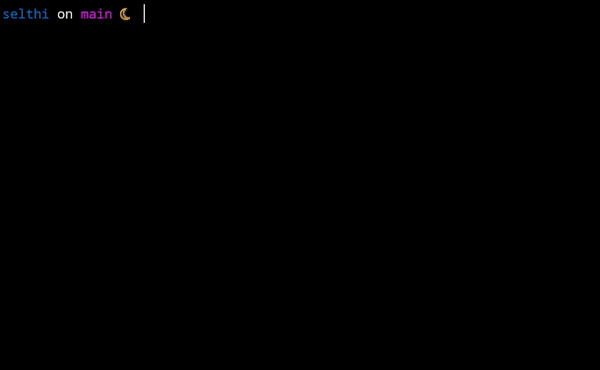

# Selthi

[![Latest Version]][crates.io] [![Docs]][docs.rs] ![License]

[crates.io]: https://crates.io/crates/selthi
[latest version]: https://img.shields.io/crates/v/selthi.svg
[docs]: https://img.shields.io/docsrs/selthi/latest?logo=docs.rs
[docs.rs]: https://docs.rs/selthi
[license]: https://img.shields.io/crates/l/selthi.svg

[selthi](https://github.com/anotherlusitano/selthi) is a library for building interactive prompts, inspired by [inquire](https://github.com/mikaelmello/inquire).

It provides two prompts, one for asking the user to select one option from a given list, with the ability to display images for each option, and other prompt for asking the user for a string.

## Demo


[Source](./examples/images.rs)

## Examples

Examples can be found in the `examples` directory. Run them to see basic behavior:

```
cargo run --example images --features with_images
```

## Usage

Add Selthi to your dependencies.

```
cargo add selthi
```

\* If you want to support images, add the feature `with_images`

```
selthi = { version = "0.2.7", features = ["with_images"] }
```

## Prompts

Currently, there are 2 different prompt types supported.

### Input

`Input` displays a message to the user, prompting them to type something back. The user's input is then stored in a String and returned to the prompt caller.

```rust
let ans = Input::new("What's your name?").prompt();

match ans {
  Some(name) => println!("Hello {}!", name),
  None => println!("There was an error, please try again"),
}
```


### Select

`Select` prompts are suitable for when you need the user to select one option among many.

```rust
    let options: Vec<&str> = vec![
        "Rust",
        "C",
        "C++",
        "Javascript",
        "Java",
        "C#",
        "Python",
        "Haskell",
        "Lisp",
        "Erlang",
    ];
    let ans = Select::new("What's your favorite programming language?", options).prompt();

    match ans {
        Some(language) => println!("{} rocks!", language),
        None => println!("There was an error, please try again"),
    }
```



You can also display images when users are choosing the options.

```rust
    let options: Vec<&str> = vec!["Linux", "Windows", "macOS"];
    let images: Vec<&str> = vec![
        "./examples/images/linux.png",
        "./examples/images/windows.png",
        "./examples/images/macos.png",
    ];

    let ans = Select::new("What's your favorite operating system?", options)
        .with_images(images)
        .without_help_message()
        .prompt();

    match ans {
        Some(os) => println!("{} is a good choice!", os),
        None => println!("There was an error, please try again"),
    }
```
